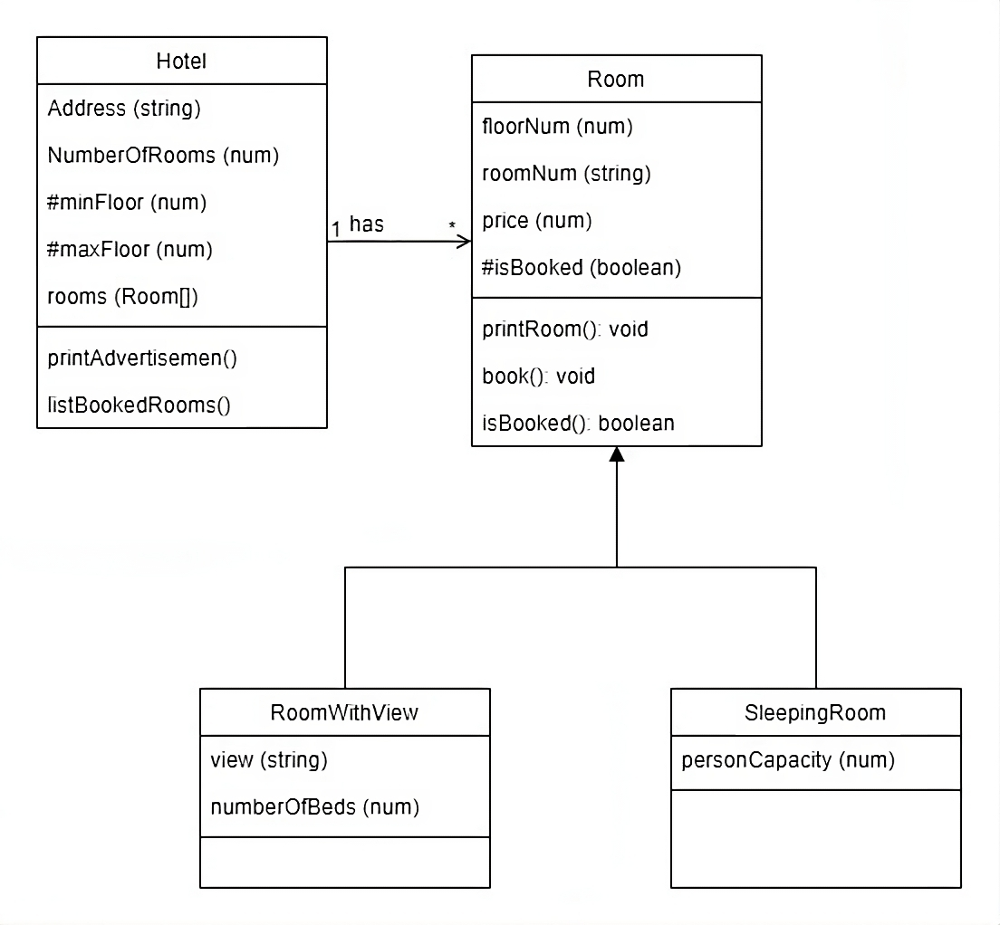

# Object-Oriented Hotel Management Application

## Description

This Node.js/JavaScript application is designed to manage a hotel and its various types of rooms. It adheres to the provided class diagram and includes the following features:

1. **No User Input Required:** The application is fully automated and doesn't require user input. It operates using mock data to showcase its functionality.

2. **Mock Data:** The application uses mock data to populate and demonstrate various scenarios within the hotel management system.

3. **Single Hotel, Multiple Rooms:** A single hotel is created, and it consists of multiple rooms, each with different room types (e.g., Standard, Deluxe, Suite).

4. **Private Members:** The classes in the application have private members as indicated in the class diagram, ensuring encapsulation and data protection.

5. **Class Relationships:** The relationships between classes have been correctly implemented, adhering to the class diagram's specifications.

6. **Extra Reading:** During development, additional research and reading may have been necessary to implement certain features and concepts.

## The Class Diagram:

